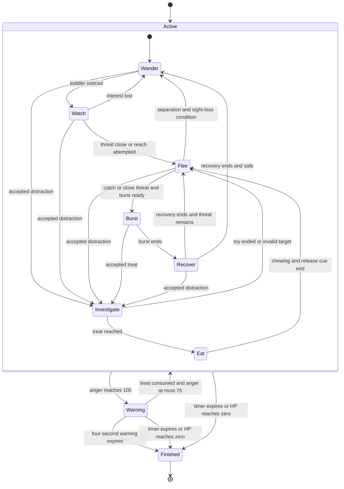
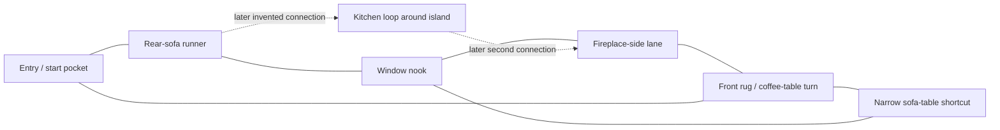
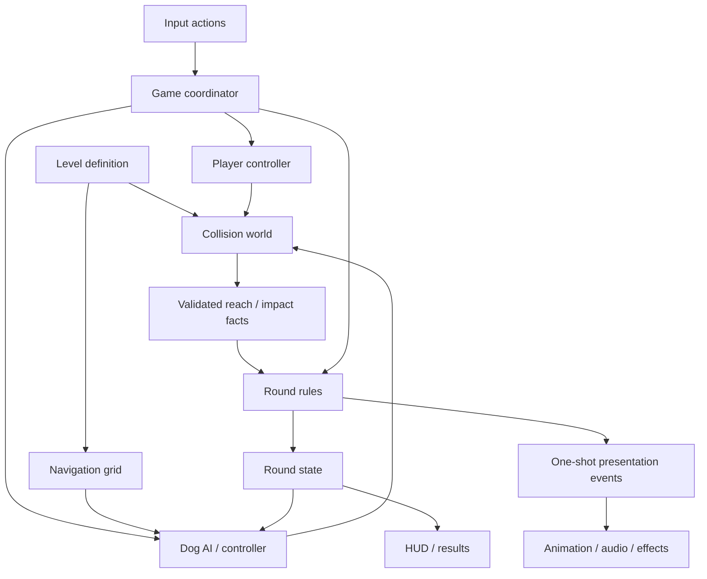

# Dog Tail Game — design and development plan

**Status:** Approved baseline, now implemented as the first desktop release. See `README.md` for shipped features, verification, and the deferred backlog.  
**Date:** September 6, 2026.

**Latest approved rule change:** HP no longer regenerates. A bandage kit restores up to 30 HP when used with Q. Running-speed hard impacts cause a 0.8-second stumble; sprint-speed impacts cause a 2.2-second fall/get-up penalty while the round timer and dog continue. These supersede the original health and collision tuning below.  
**Goal:** Prove that chasing, anticipating, and briefly catching a cartoon dog's tail is fun in a small first-person browser game.

All gameplay values below are starting hypotheses for playtesting, not measured balance results. The room observations come from all five supplied photographs. Technology recommendations draw on the linked official documentation; the choice between viable stacks is a project-specific judgment.

## 1. Recommended direction

Build a desktop-first, single-player, three-minute arcade chase in a stylized family living room. The player is a toddler with quick feet, a little movement momentum, and a forgiving reach. The dog escapes through recognizable routes, occasionally looks back, and gets better at evading the player after each catch. Players score by anticipating its route rather than endlessly following its exact footsteps.

Each catch creates a choice: press for a combo, use an earned treat to calm the dog and set up an interception, or back away long enough to lower anger. Furniture makes those decisions spatial: the outer route is forgiving, the gap beside the coffee table is faster but risky, and the sofa breaks sightlines.

**Recommended stack:** TypeScript + Vite + Three.js, Rapier for kinematic collision handling, a small custom A* navigation grid, and ordinary HTML/CSS for the HUD. Keep game rules independent of rendering. No backend is needed for the first release.

**First release boundaries:** one connected floor, one dog, one round mode, keyboard/mouse, static furniture. The earliest prototype uses boxes and a recognizable primitive dog. Kitchen expansion, pickups, animated art, and touch controls follow only if the basic chase works.

The tone is affectionate slapstick. A successful grab is a brief catch-and-release animation, never dragging or injuring the dog. At maximum anger the dog delivers an exaggerated “enough!” bark and a parent calls time-out; it does not attack.

## 2. Primary loop and round rules

1. Start in a clear area facing the dog, approximately 3 m away. A three-second countdown precedes simulation and timer start.
2. Chase around furniture, preserve sprint for closing distance, and watch the dog's turn cues.
3. Aim near the tail and press grab. A valid catch awards points, raises anger, advances permanent difficulty, and advances treat progress.
4. The dog briefly reacts and escapes. The player selects a new interception route rather than repeating a catch in place.
5. Spend treats or allow cooling time when anger becomes dangerous. Later pickups provide alternative tactical choices.
6. Finish at 180 seconds, zero HP, or an unresolved maximum-anger warning. Show results and offer an immediate restart.

| Rule | Proposed value / behavior |
| --- | --- |
| Standard round | 180 seconds of active simulation; no time-extension pickups |
| Expected session | Typical completed round is 3 minutes; early failures can be shorter than 2 minutes |
| Starting resources | 100 HP, 0 anger, 0 treats, 0 treat progress, full sprint |
| Catch target | Aim for roughly 12–20 catches in a practiced round; validate in playtests |
| Pause | Escape, pointer-lock loss, hidden tab, or lost window focus pauses simulation and clears held inputs |
| Resume | Explicit click; reacquire controls before restarting simulation |
| Restart | Reset the complete round, dog difficulty, cooldowns, pickups, and temporary effects |
| Persistent data | Local best score and settings only; saving failure must not prevent play |
| End priority | At a fixed-step boundary, already-expired time ends the round; otherwise resolve that tick's actions and resource changes, then HP failure, unresolved anger deadline, and timer expiration |

No score loss on failure: retain earned catch points, but only a timer completion receives completion bonuses. Later two- or five-minute modes would need separate records; do not add them to the MVP.

## 3. Toddler movement, reach, and collisions

### Controls and feel

| Action | Desktop default |
| --- | --- |
| Move | WASD; normalize diagonals |
| Look | Arrow keys or mouse, with mouse sensitivity and invert-Y settings |
| Sprint | Hold Shift while moving and while charge remains |
| Grab | Left mouse button or Space, one attempt per press |
| Treat | E, assisted toss toward the visible dog |
| Held pickup ability | Q, introduced after MVP |
| Pause | Escape |

Start with a **0.72 m eye height**, 0.24 m collision radius, approximately 0.90 m character height, and a 75-degree vertical field of view adjustable from 60–90 degrees. These are cartoon scale choices. Keep the visible tail near the player's natural downward view; begin with a medium dog approximately 0.55 m at the shoulder and an exaggerated tail.

Normal speed is **3.8 m/s**, sprint is **5.2 m/s**, and acceleration is **12 m/s²**. Braking is stronger, around **16 m/s²**. A direction reversal therefore has a little momentum without becoming an ice-skating mechanic. Sprint charge provides **1.4 seconds** at full speed, then refills over **4 seconds**, beginning **0.75 seconds** after sprint stops. Releasing and tapping sprint cannot bypass the refill delay.

Mouse look is immediate: do not artificially limit camera turning. Clumsiness comes from body velocity, hand animation, footstep rhythm, and impacts. Default camera bob is subtle, around 1 cm; expose an off switch. No camera roll, compulsory head shake, or dynamic sprint FOV. Staggers preserve mouse look and grab input. No jumping, crouching, climbing, or stairs in the MVP.

### Tail-catching contract

A catch requires all of the following:

- An active round, a new grab press, and no active grab cooldown.
- A target point on a forgiving tail capsule, approximately 0.18 m radius, within **1.05 m** of the player's logical reach origin.
- The target is within a **30-degree half-angle** of the aim direction and lies in the dog's rear half-space. The player cannot catch through its body from the front.
- The reach segment is unobstructed by furniture or walls. A wagging tail sticking visually through a wall must not create a valid through-wall catch.
- The dog is not eating, in its protected escape period, or in the maximum-anger warning state.

Use the same query for the “in reach” reticle and the actual action. The forgiving volume follows the dog's body and tail base, with limited animation offset; tiny tail-tip movements must not invalidate otherwise good aim. Use simulation transforms and sweep between ticks where necessary to avoid fast motion skipping a valid reach.

Each press opens a **0.18-second reach window**, with at most one success. Misses have **0.45 seconds** of recovery; holding the button does not auto-repeat. After a catch, the dog is immune to another catch for **2.5 seconds**, with a visible tail sparkle/escape cue. It reacts for about 0.2 seconds and runs away; the player is never physically attached to it.

### Hard and soft furniture

Furniture receives a gameplay material tag independent of its visual material. Use simple, predictable colliders that broadly match the silhouette. Thin decorative details do not become surprise collision traps.

**Hard:** walls, coffee table, table/chair frames, cabinets, closed doors, and the simplified hearth boundary. Damage depends on speed **into the surface**, not total speed; skimming along a wall should be safe.

| Incoming normal speed | HP lost | Movement reaction |
| --- | --- | --- |
| Below 2 m/s | 0 | Slide/block normally; quiet bump |
| 2 to below 3.2 m/s | 4 | 0.15-second slowdown |
| 3.2 to below 4.5 m/s | 8 | 0.25-second stagger |
| 4.5 m/s or greater | 12 | 0.35-second stagger |

A damaging impact removes the inward velocity and temporarily caps movement at 60% speed. Apply damage only on a new impact, with a **1-second global damage cooldown** and contact rearming after separation. Simultaneous corner contacts produce one damage event using the highest eligible impact. Standing against furniture or sustaining contact never drains HP every frame. Reaction time does not stack indefinitely.

**Soft:** couch, armchair, padded ottoman, and cushions. The couch remains solid; contact absorbs inward momentum and imposes a **0.4-second, 70%-speed cap**, but causes no damage and does not reset the combo. Repeated contact refreshes the cap rather than stacking it. Floor cushions later act as **60%-speed zones** with no damage. If multiple slows apply, use the lowest cap, not their product.

For readability, treat an upholstered ottoman as wholly soft even though its legs are wood. A wooden chair remains hard. Decorative clutter on tables is non-colliding. Furniture is fixed in the MVP; movable cushions and climbing would alter both collision and navigation and require separate testing.

### Health and failure

Start with **100 HP**. Regenerate **3 HP/second**, up to 100, after **8 seconds without a damaging impact**. Regeneration pauses during any active stagger. Neither the dog nor anger directly causes HP damage; the two risk systems remain easy to understand.

At zero HP, the toddler sits down with cartoon stars and the round ends with “Nap time!” HP cannot revive after that end transition. Health should forgive occasional collisions while making repeated sprinting into hard furniture costly. A later accessibility preset can reduce damage, with separately labeled records.

## 4. Dog AI and difficulty

### Behavioral principles

The dog navigates toward purposeful destinations: an open lane, a sofa corner that blocks sight, the far side of the coffee table, or a valid treat. It chooses among several sensible paths with seeded randomness. It never uses independent random movement on each frame.

The dog reacts to visible toddler movement within about **5 m**, and can notice nearby footsteps within **3 m** through furniture. After losing sight, its evasion uses the last known player position for **2 seconds**, then considers open routes. It does not continuously track the player's hidden position across the whole room.

Threat enters at **3.5 m** with line of sight, or a nearby reach attempt. Exit requires **more than 5 m** separation and **1.5 seconds** without sight; this hysteresis prevents state flicker. A minimum initial watch of **0.8 seconds** gives the first chase a readable start.

### State diagram



The diagram shows the complete planned behavior. MVP can omit Watch as a separate state, toy investigation, hiding choices, and jukes; it retains simple wandering/fleeing, burst/recovery, treat investigation/eating, and warning. Returning from Warning resumes fleeing, rather than restarting the initial wander/watch grace.

| State / behavior | Readable action and limits |
| --- | --- |
| Wander | Sniff or walk slowly between safe points; 1–2 seconds of idle at low difficulty |
| Watch | Turn head, wag once, then lean toward the intended exit |
| Flee | Follow a path away from the last perceived threat; prefer routes with multiple exits |
| Burst | 0.8–1.1 seconds of extra speed, at most once per 5 seconds; cannot chain indefinitely |
| Recover | At least 0.8 seconds at about 1.6 m/s after a burst; sniff/look-back cue advertises the opening |
| Hide / juke | Later choices within Flee, not new global systems; hide briefly behind cover or switch a route after a 0.25-second lean cue |
| Investigate | Commit to a reachable distraction; ordinary toys lose to close danger, accepted treats take priority |
| Eat | Stop for 2 seconds; no tail catches; 0.4-second head-up cue before normal chase resumes |
| Warning | Stop scoring opportunities, bark, show countdown, and allow one valid treat rescue |

Even without a burst, a continuously fleeing dog must offer an **0.8–1.2-second slowdown after at most 7 seconds of pursuit**. This is visible fatigue, not a hidden teleport or a forced automatic catch. Hiding lasts at most **1.5 seconds**, with an audible collar jingle and a reachable exit. Do not select deep dead ends or routes unavailable to the player in the MVP.

### Capped progression

Let `G` be successful catches. These increases persist until restart; treats never reverse them.

| Attribute | Proposed progression |
| --- | --- |
| Cruise speed | `2.7 + 0.06 × min(G, 15)` m/s; anger at 50+ adds 0.15 m/s, absolute cap 3.75 m/s |
| Burst speed | `4.2 + 0.05 × min(G, 14)` m/s; absolute cap 4.9 m/s |
| Acceleration | 8 to 11 m/s² over the first 12 catches |
| Reaction delay | 0.45 seconds initially, falling to a floor of 0.25 seconds |
| Jukes | Unlock after catch 4; cooldown decreases from 8 to no less than 5 seconds |
| Route changes | Later dog favors a different loop and avoids repeating its last two destinations |
| Idle time | Decreases, but mandatory recovery opportunities remain |

The toddler remains faster while sprinting. Increasing difficulty comes mostly from earlier reactions, cover, and choosing exits. Do not further scale speed with elapsed time; final-30-second music and HUD changes can make the finale feel urgent without stacking another hidden difficulty curve.

### Navigation and collision contract

For one flat room, use an **8-connected, 0.25 m A* grid** on the XZ plane. Build occupancy from the same authored obstacle definitions as collision, inflated for the dog's collision radius plus margin. Disable diagonal corner-cutting. Smooth paths only when a swept-radius clearance query confirms the shortcut is safe.

At 12 × 9 m, the base grid has about 1,728 cells. Replan at most **5 times/second**, or on a meaningful blocked-path event, with cooldown. Select reachable candidate goals by distance from perceived threat, clearance, exit count, path length, and recent-route repetition. Keep a chosen goal for at least 0.6 seconds unless it becomes invalid.

Use an upright capsule for the dog so yaw animation does not require rotating a long physics collider. Art and tail extend beyond that proxy; check the tail's reach occlusion separately. The dog collides with furniture. Player/dog contact uses gentle separation without damage and is excluded from long-term grid occupancy, so the player cannot permanently pin the dog into a corner.

If movement advances less than 0.1 m over 0.75 seconds despite a nonzero desired velocity, replan to a nearby valid escape point. If repeated recovery fails, flag a navigation bug in the development overlay; do not hide routine failures with visible teleporting. Validate spawn points and a connected route before starting a round.

## 5. Anger and treat economy

### Anger rules

Anger ranges from **0–100**, starting at zero. Each valid catch adds **18**. Misses, furniture bumps, and ordinary movement do not add anger. Anger decays at **2 points/second** only after **4 uninterrupted seconds** in which the toddler remains more than **4 m away** and makes no grab attempt. Closing the gap or attempting a grab resets that cooling delay.

This makes backing off an intentional loss of scoring time. No passive cooling occurs while the dog is eating or during the maximum-anger warning; treat consumption provides its own explicit reduction.

| Anger | HUD stage | Dog presentation / behavior |
| --- | --- | --- |
| 0–24 | Calm | Loose ears, wag, longer sniffing moments |
| 25–49 | Annoyed | Side-eye, short huffs, more frequent look-backs |
| 50–74 | Agitated | Brief comic grumbles, small capped cruise-speed modifier, stronger preference for cover |
| 75–99 | Very Angry | Bark cues and conspicuous HUD caution; more juke choices within existing cooldowns |
| 100 | Enough! | Four-second countdown; catches disabled; treat rescue or round ends |

At 100, latch a **4-second warning**. A consumed treat must bring anger to **75 or below** before the deadline to cancel it. A valid rescue at the exact deadline resolves before expiration in that tick. The dog may approach the accepted treat within the warning state; the warning clock keeps running until consumption. Without a treat, the warning ends the round. This is intentional: disengage before reaching 100 if inventory is empty.

Warning priority overrides pickups and ordinary behavior. It does not bite, chase the toddler, or remove HP. The 75–99 stage gives advance notice before the terminal countdown.

### Earning and using treats

| Rule | Proposed value / behavior |
| --- | --- |
| Earning | Every 3 successful catches earns 1 treat |
| Inventory | Start with 0; maximum 3 |
| Progress display | Always show 0/3, 1/3, or 2/3 catches toward the next treat |
| Overflow | On the third catch while inventory is full, the earned treat is lost and progress resets; show “Treat pouch full” |
| Input | E; contextual assisted toss with the dog visible and within 5 m |
| Valid target | Unobstructed throw to reachable floor within 1.5 m of the dog; delivery path no longer than 2 m |
| Invalid action | No inventory consumed; show “Get closer” or “Clear the throw” |
| Consumption | Dog commits to the treat; anger falls by **32** when it reaches and eats it, clamped at zero |
| Timing | Throw plus approach should take no more than 1.5 seconds in a valid open setup; chewing lasts 2 seconds |
| Reuse | 8-second cooldown from a valid use; one treat active at a time |
| Catch restriction | No catching during eating; existing post-catch immunity still applies afterward |

Validate the destination before consuming inventory. Use a simple checked toss arc, not a simulated bouncing biscuit. If a later gate change makes an accepted treat unreachable before consumption, cancel and refund it. Treat initiation remains possible during a protected escape period or a warning. If a catch earns a treat and triggers a warning in the same tick, credit the treat first; it can be used on the next input.

Treats serve two purposes: reducing anger and changing where the next chase begins. They do not award free points or reset difficulty. Eating is protected, but the player can circle behind the dog and prepare a catch after the head-up cue. Do not automatically force an extra burst when chewing finishes.

### Economy sanity check

Ignoring cooling and assuming one treat used after each group of three catches:

| Total catches | Anger before that group's treat | Anger after treat |
| --- | --- | --- |
| 3 | 54 | 22 |
| 6 | 76 | 44 |
| 9 | 98 | 66 |

Each three-catch group adds 54 anger and earns only 32 relief: **net +22**. Treats cannot erase the mechanic. After the ninth catch and treat, catch 10 reaches 84; catch 11 triggers maximum anger if there has been no cooling. With no saved treat at that point, the player needed to disengage earlier.

A ten-second break at safe distance gives six seconds of active cooling after the four-second delay, removing **12 anger**. About 15 seconds of separation removes 22 anger. The tradeoff is meaningful because the combo expires after 12 seconds. These examples are arithmetic checks, not evidence that the resulting pacing is fun; playtesting must determine whether the cooling requirement is too intrusive.

## 6. Pickups and temporary upgrades

Introduce pickups after the complete MVP. Use **one held ability slot**, separate from treats, and at most one active toddler buff. Walk within 0.65 m to collect into an empty slot; Q uses it. With an occupied slot, show the new item's identity but require an explicit swap input rather than silently replacing it. A different active buff replaces the old one; identical buffs refresh up to their original duration and never stack.

Start by testing only **Juice Box, Stuffed Animal, and Squeaky Toy**. The remaining items are designed options, not release requirements.

| Pickup | Proposed effect | Tradeoff / exploit guard | Priority |
| --- | --- | --- | --- |
| Juice Box | +15% toddler normal and sprint speed for 6 seconds; sprint charge is unchanged | Faster impacts still use the damage table; replacing another buff sacrifices it | First pickup set |
| Stuffed Animal | Halves hard-impact damage for 10 seconds; round fractional HP damage up | Does not prevent slows or combo loss; occupies the buff slot | First pickup set |
| Squeaky Toy | Toss onto reachable floor within 4 m; dog investigates for up to 3 seconds | No anger reduction; at most one catch from the distraction; catch immediately ends it | First pickup set |
| Snack Cracker (human food) | Dog investigates and eats for up to 3 seconds | No anger reduction, eating is protected, then +0.2 m/s dog cruise for 5 seconds, still capped at 3.75 m/s | Later; weaker strategic alternative to a treat |
| Rolled Socks | Dog investigates scent for 1.5 seconds, exposing a different approach angle | Shorter than toy, no anger relief; one valid toss, not a wall-penetrating lure | Later |
| Baby Gate Key | Opens a marked connection for 12 seconds | Both toddler and dog may use it; changes pursuit routes; gate stays open until its doorway is clear | Only with kitchen/route expansion |
| Bubble Wand | Creates a readable 2-second bubble patch; dog slows 25% while in it | Player also slows 15%; no anger effect; no opaque screen coverage | Rare later item, at most one per round |
| Slipper Socks | Improves player braking for 8 seconds | Replaces speed/protection buff; advantage is control rather than raw speed | Later alternative |

All ordinary distractions are ignored during Warning. Toys/socks/bubbles cannot repeatedly stun the dog: use a **6-second distraction immunity** after a non-treat distraction ends, exposed by a simple HUD cue. Treats are exempt from that immunity but retain their own cooldown. Every distraction respects the global 2.5-second catch immunity and caps at one catch. A catch ends the current distraction and triggers escape.

For the first pickup experiment, place two seeded items at authored points and refill **one vacant point every 25 seconds**, up to three world items. Occupied spawn points never create duplicate items. Require reachable floor, at least 1.5 m from both characters, and avoid placing items inside a blocked passage. Favor the window nook or risky coffee-table approach so collection costs a route choice. No passive treat spawns, no permanent upgrades, and no essential progression locked behind random pickups.

The rare Bubble Wand may grant a one-time **50-point find bonus** if included later; all ordinary pickup collection awards zero points. The bonus should stay too small to make ignoring the dog a scoring strategy.

## 7. Scoring and HUD

**A catch is worth 100 base points.** Let `C` be the current chain length including this catch. If the previous catch was at most **12 seconds** ago and no damaging hard collision occurred, increment the chain; otherwise begin at 1.

`multiplier = min(2, 1 + 0.25 × (C − 1))`

Use the dog's anger **before the catch**, so the player cannot receive a risk bonus merely by crossing a threshold with that catch:

- Calm / Annoyed: +0 risk points.
- Agitated: +15 risk points.
- Very Angry: +30 risk points.

Add **+20 clean-chase points** if no damaging hard collision occurred since the previous catch (or round start for the first catch). Then:

`catch points = round((100 + risk bonus + clean bonus) × multiplier)`

For example, a fourth chained catch at 60 anger with a clean approach earns `(100 + 15 + 20) × 1.75`, rounded to **236 points**. A damaging impact immediately resets the chain and loses the next clean bonus; a soft bump does neither. A miss does not reset the chain but costs reach time. There is no separate quick-catch bonus: the combo already rewards speed.

On timer completion only, add **200 completion points**, **2 × remaining whole HP**, and **25 per unused treat**. Failure retains earned catch and rare-find points without these completion bonuses. High-anger catches can still score on the catch that triggers Warning, provided the round was active and the dog was catchable at validation.

### During a round

- Top center: time remaining; concise final-30-second cue.
- Top left: score and current multiplier with its expiring chain indicator.
- Top right: anger bar, text stage, and warning countdown when active.
- Lower area: HP, sprint charge, treat count with earning progress and cooldown, and later the held pickup.
- Center: small reach reticle and concise prompts such as “In reach,” “Eating,” or “Cooling down.”

Pair color with labels/icons; the anger meter must work without relying on red/green distinction. Keep the reticle unobtrusive and avoid flashing full-screen damage effects. The title screen provides a one-line objective and controls; detailed help and comfort settings sit in pause/settings.

### End-of-round screen

Show total score, local best/new-best indicator, end reason, elapsed time, catch count, highest multiplier, catch/risk/clean bonus breakdown, highest anger, treats earned/used/remaining, hard impacts, remaining HP, and completion bonuses. Put **Play Again** first, then settings. Keep optional detailed stats expandable so the headline result remains easy to read. Record the ruleset version with the best score; future assisted modes should use separate records.

## 8. Photo inspection and playable room translation

All five images in `room-images/` were inspected. They are different views of the living room and adjoining circulation space, not enough evidence for a measured floor plan. **No kitchen layout or identifiable dog reference is visible.** Dimensions, exact doorway connections, and the proposed kitchen are design assumptions requiring confirmation if real-world fidelity matters.

| Reference | Observed features | Gameplay translation |
| --- | --- | --- |
| `IMG_4839.jpeg` | Low view of heavy wooden coffee table, cream seating, woven rug, striped wooden armchair, round upholstered stool, built-ins flanking glazed double doors, fireplace guard at the edge | Coffee table as the main hard obstacle; chair as a secondary hazard; stool as a soft brake; recognizable doors and shelves as navigation landmarks |
| `IMG_4840.jpeg` | Tight sofa/table gap, cream sectional, navy patterned quilt, pale blue wall, white trim, stair railing beyond | Widen the gap into an optional risky shortcut; use blue quilt as a clear sofa landmark; close stairs with a decorative gate |
| `IMG_4841.jpeg` | Broader view of sectional around the rug and table, tall windows, lamps/table behind sofa, round ottoman, wood floor strip by fireplace/instruments | Preserve the coffee-table chase loop and strong sofa silhouette; clear the floor strip into a reliable return lane |
| `IMG_4842.jpeg` | Runner corridor behind sofa, entry door and staircase, closed side door, toy cart near the corridor | Make a wider rear-sofa route for sprinting/interception; use toy cart as a deliberate corner landmark rather than a full corridor blockage |
| `IMG_4843.jpeg` | Narrow window-side area behind sofa with wooden table, striped chairs, large lamps, plant/stool, hardwood floor | Simplify into a window nook with two exits, a brief dog hiding point, and an optional pickup detour |

### Proposed geometry

Begin with an approximately **12 × 9 m design envelope**, one flat floor and no usable exterior doors. This is enlarged gameplay geometry, not a claim about the room's real size. Keep the sofa, table, fireplace, entry corridor, window nook, pale walls, and white trim recognizable. Remove most small clutter from the floor and move delicate decorative objects to non-playable edges.

Use a roughly **2.2 × 1.3 m** central coffee table and an exaggerated **4.5 × 3 m** L-shaped sectional as initial blockers. Iterate these sizes together with movement speed. The coffee table is a solid gameplay footprint in the MVP; neither character runs underneath its visually open legs. A shallow basket/apron can communicate that blocked space. Under-table crawling is a later mechanic requiring its own height-aware navigation.

Primary lanes should be **1.4–1.8 m** wide between visible obstacle surfaces. One optional coffee-table/sofa gap may be **0.95–1.1 m**, still navigable by both characters. Do not reproduce the tightest photographic gaps literally. Give major loops two exits and avoid sharp cul-de-sacs.

### Route topology

This is a proposed connection diagram, **not a surveyed or compass-oriented floor plan**:



| Feature | Intended decision |
| --- | --- |
| Coffee-table loop | Learn the basic chase and intercept around opposite corners |
| Outer sofa loop | Safer, longer route; dog can break sight while player chooses the other end |
| Rear-sofa runner | Open sprint area approximately 5–6 m long after enlargement |
| Sofa-table gap | Shorter path with hard table on one side and forgiving sofa on the other |
| Window nook | Brief hiding/detour opportunity; two exits prevent corner camping |
| Fireplace turn | Readable hard boundary and a braking test, with guard reduced to one broad collider |
| Start pocket | Open area with no immediate impact or blind spawn; clear first view of dog |

A future kitchen can be an explicitly invented **4 × 5 m** annex with an island and **two connections**, creating another loop rather than a dead-end room. Use cabinetry as hard obstacles and a broad clear turning area. Do not make kitchen construction a dependency of answering whether the one-room chase is fun.

### Art direction and asset scope

Use colorful low-poly forms with softened edges and matte materials: pale blue walls, cream sofa, honey-brown floor, dark wood coffee table, navy quilt accents, and a few blue-and-white ceramic details. Exaggerate the height of furniture from the toddler camera, but exaggerate free floor space too.

The dog should be the most readable object: warm contrasting coat, oversized ears and tail, clear front/rear silhouette, simple walk/run cycles, head turns, tail wag, and comic eyebrow poses. Start with grouped primitive meshes and procedural movement. Later replace it with one modest rigged GLB containing idle, trot, run, look-back, eat, and bark clips, while retaining the same stable logical tail target.

Use simple geometry and broad color shapes for furnishings; a small texture atlas can carry rug/quilt patterns. One soft directional light and ambient fill are sufficient. Add inexpensive contact/blob shadows before expensive postprocessing. Avoid simulated fur, cloth, breakable props, mirror reflections, or photorealistic reconstruction.

Keep original room photographs outside deployed assets. Recreate room features using game geometry/materials; photos and personal items in the references need not become textures or characters.

## 9. Browser technology recommendation

### Options evaluated

| Option | Why it could fit | Tradeoff for this game | Decision |
| --- | --- | --- | --- |
| **Three.js** | Direct control of a small 3D scene and render loop | We provide gameplay, collision integration, and navigation | **Recommended** for a small code-owned project. [Three.js scene guide](https://threejs.org/manual/en/creating-a-scene.html) |
| **React Three Fiber** | React renderer for Three.js; useful for reusable declarative scene components | Adds React conventions to a project whose HUD and scene are small; per-frame simulation still needs deliberate ownership | Good if the maintainer strongly prefers React; no need to add it solely for 3D. [R3F introduction](https://r3f.docs.pmnd.rs/getting-started/introduction) |
| **Babylon.js** | Broader engine features, including animation, audio, collisions, physics integration, and navigation mesh support | More built-in engine machinery than this flat, one-dog prototype needs | Strong runner-up if integrated tooling matters more than a minimal custom game loop. [Babylon specifications](https://www.babylonjs.com/specifications/) |
| **PlayCanvas** | Web-focused engine usable standalone or with its editor; TypeScript declarations available | Editor workflow could help visual level authoring, but is not necessary for this small repository workflow | Viable; choose if browser editor collaboration becomes a priority. [PlayCanvas engine guide](https://developer.playcanvas.com/user-manual/engine/) |
| **Phaser + 3D integration** | Useful ecosystem for 2D browser games | Phaser's documented core is 2D, without built-in 3D rendering/physics; adding another renderer complicates ownership | Reject for this first-person 3D game. [Phaser documentation](https://docs.phaser.io/) |
| **Downloadable engines / custom WebGPU engine** | Could support broader game ambitions | Introduces tooling or engine work without resolving the first chase-design question | No compelling reason at current scope |

### Chosen components

| Concern | Recommendation |
| --- | --- |
| Language/build | TypeScript, Vite, npm, pinned compatible dependencies and a committed lockfile when implementation begins |
| Rendering | Three.js `WebGLRenderer`; target WebGL 2, feature-detect failures, keep WebGPU optional for future work |
| Movement/collision | Rapier 3D, fixed environment colliders and kinematic capsules; arcade velocity control remains our code |
| Navigation | Small A* grid derived from level blockers; no navmesh service or worker initially |
| AI | Explicit finite state machine with a few scored goal choices and seeded randomness |
| Animation | Primitive procedural animation first; Three.js animation playback with a GLB rig later |
| Sound | Small Web Audio manager; footsteps, collar, catch squeak, impact, treat, warning, UI; mute and separate SFX/music settings |
| Input | Browser keyboard/pointer input, pointer lock, action mapping separated from simulation |
| HUD | HTML/CSS overlay with semantic menu buttons; no 3D text needed for primary HUD |
| Persistence | Versioned localStorage record; graceful failure if storage is unavailable |
| Tests | Vitest for rules/navigation; Playwright for browser lifecycle and smoke coverage; manual playtests for feel |
| Hosting | Static Vite output; Vercel, selected by the user; build `dist/` as a static Vite site |

The current Three.js WebGL renderer requires WebGL 2; do not promise a WebGL 1 fallback. This recommendation deliberately avoids making WebGPU a minimum requirement. [Three.js WebGLRenderer](https://threejs.org/docs/pages/WebGLRenderer.html)

Rapier provides move-and-slide character control and collision queries, but its built-in controller handles translations rather than rotational movement. Use upright capsules and rotate visuals independently. Collision damage and soft slowing are game rules applied to collision results, not natural rigid-body forces. This avoids having to write a robust swept collision solver before testing the chase. [Rapier character controller](https://rapier.rs/docs/user_guides/javascript/character_controller/)

Request pointer lock from the Start/Resume gesture and handle rejection or loss. Offer a drag-to-look fallback if lock is unavailable, with a clear control hint. Unlock audio through the same gesture; allow silent play if audio activation fails. [MDN Pointer Lock API](https://developer.mozilla.org/en-US/docs/Web/API/Pointer_Lock_API), [MDN Web Audio practices](https://developer.mozilla.org/en-US/docs/Web/API/Web_Audio_API/Best_practices)

For deployment, build into `dist/`, preview locally, then upload/publish that static output. `vite preview` is a local verification server, not a production host. Choose an account/provider during the deployment phase; no backend, login, database, or public leaderboard is needed. [Vite static deployment guide](https://vite.dev/guide/static-deploy)

### Performance and future mobile support

These are provisional budgets to verify on named hardware, not measured promises:

- Target 60 fps at 1080p on a representative laptop with integrated graphics; accept a deliberate 30 fps quality tier on later mobile support.
- Start with at most roughly 100 visible draw calls, 100k visible triangles, one shadow-casting light, and a device-pixel-ratio cap of 1.5. Reduce shadows/resolution before reducing gameplay correctness.
- Aim for under 10 MB of compressed initial game assets; load music later if necessary. Avoid placing the approximately 27 MB of original reference JPEGs in the deployment output.
- Use shared materials/geometries, pooled short-lived effects, and no per-frame object churn in the simulation hot path. Profile before adding instancing, workers, or elaborate culling.
- Phones/tablets need separate touch interaction testing: left movement stick, right drag-to-look, large grab/treat buttons, orientation handling, thermal tests, and accessible control spacing. Responsive HUD alone does not make the game mobile-ready.

## 10. Practical architecture and state ownership

Use a single `Game` coordinator, a plain typed `RoundState`, and small modules. Avoid an ECS framework, global mutable singleton, Redux store, or general-purpose message bus for this scope.

| Module | Owns / does | Communicates with |
| --- | --- | --- |
| Game / GameManager | Loading, menu, countdown, playing, paused, results; update order and reset | All modules through explicit calls |
| PlayerController | Desired velocity, acceleration, sprint, camera aim | Input, collision; emits reach/treat intents |
| DogController + DogAI | Dog state, timers, perceived threat, destination, desired motion | Navigation, collision, rules snapshot |
| Navigation | Occupancy, reachable goals, paths, clearance | Level definitions and DogAI |
| CollisionSystem | Physics world, kinematic movement, contacts, reach occlusion | Player/dog and level; returns facts, not score changes |
| RoundRules | HP, anger, treats, score, timer, modifiers and end decisions | Receives validated actions/impacts; updates RoundState |
| PickupSystem | Spawn points, one held item, effect requests | RoundRules and navigation; only after MVP |
| LevelManager | One authored level definition, meshes/colliders, spawn validation | Rendering, collision, navigation |
| Presentation | Dog animation, hand reach, camera bob, effects | Reads transforms and one-shot gameplay events |
| AudioManager | Sound loading, playback, volume, pause | Reads gameplay events and character positions |
| HUD / menus | Readable view of state; menu commands | Reads state snapshots; sends start/pause/settings actions |

HealthSystem, AngerSystem, TreatSystem, ScoreSystem, and TimerSystem can begin as focused functions within `RoundRules`, then split into files as they grow. Names represent responsibilities, not a requirement to create a class per concept.



`RoundState` includes elapsed/remaining time, HP and regeneration delay, anger and warning deadline, catches/difficulty, treats and progress, combo timestamps, score breakdown, action cooldowns, active effects, metrics, and end reason. Scene meshes are not the authoritative store for any of these values. Store settings and local records separately from round state.

### Update order and lifecycle

Use a **60 Hz fixed simulation step**, driven by the renderer's frame loop, and interpolate visuals between completed steps. Limit catch-up to five steps per rendered frame; a long interruption pauses rather than simulating seconds of unseen collisions. All gameplay timers share the same active simulation clock. Do not use independent `setInterval` timers for anger, cooldowns, or the round.

Within a playing step:

1. Check an already-terminal round or expired timer; consume queued action edges once.
2. Read current effects/perception, choose dog goals, and compute player/dog desired motion.
3. Resolve motion against collision geometry; synchronize physics/query transforms.
4. Validate reach/throw actions at the resolved positions and gather contact facts.
5. Resolve damaging impacts first, then a valid catch: award points using pre-catch anger, increase catch count/difficulty/anger, credit earned treats, and apply catch immunity.
6. Resolve accepted treat consumption, regeneration/cooling eligibility, effect durations, warning transitions, and active time. Suppress passive anger decay on a catch/consumption tick to keep thresholds predictable.
7. Apply one end transition following the priority in Section 2; publish state changes and one-shot presentation events.

HUD can update changing numbers at 10–20 Hz and react immediately to events; animation remains frame-smooth. Presentation events such as `TailCaught`, `HardImpact`, `TreatConsumed`, and `RoundEnded` are a small queue drained once, not a second source of game state.

On pause, freeze all simulation clocks and gameplay sound loops. On restart, clear action queues, AI memory, effect instances, physics state, cooldowns, navigation reservations, and pending audio events. Reuse loaded assets while rebuilding round state. Prevent duplicate event listeners and animation loops across restarts.

## 11. MVP and the first fun test

Separate the **first chase prototype** from the **complete MVP** so art and economy do not obscure the basic question.

### First chase prototype — first milestone

One box room with a sofa block and coffee-table block; toddler-height movement and sprint; hard/soft collision response; a primitive dog following valid routes; basic fleeing with a recovery opening; tail-catching feedback and count; restart. Use optional developer toggles for collisions and fixed dog speed.

**Question:** “Is chasing this dog around the room actually fun?”

Observe at least 3–5 people who have not helped tune the controls. Provisional gate: most catch the dog within 30 seconds, make several intentional catches in a two-minute session, understand why a miss failed, and voluntarily attempt an interception or another round. These are small qualitative tests, not a statistical product validation. If players only follow a perpetually escaping dog, change routes, reaction delay, and catch reach before adding pickups or art.

### Complete MVP — after core systems

- One living room, initially graybox and inspired by the reference layout.
- First-person movement, sprint, comfortable look controls, and pause/resume.
- Collision detection, hard damage, soft slowing, HP and regeneration.
- One recognizable primitive dog with basic navigation, fleeing, burst/recovery, and capped catch difficulty.
- Forgiving but occlusion-aware tail catching, catch cooldown, score and combo.
- Anger stages, warning/end behavior, earned treats, assisted toss, protected eating.
- Three-minute timer, HUD, result screen, full restart.
- Minimal essential feedback: catch, impact, eat, anger warning; polished animation/sound is deferred.

**MVP acceptance:** a complete round and repeatable restart; no through-wall catches; no repeated damage from sustained contact; no dog stuck for more than 2 seconds in tested routes; no treat/catch farming; all three end reasons behave correctly; pause freezes every gameplay timer; no material movement-speed changes between 30/60/120 fps render conditions.

Excluded: pickups, kitchen, climbing/crawling, moving furniture, photorealistic art, advanced jukes, multiplayer, accounts, global leaderboards, procedural levels, touch support, and advanced audio/visual polish. Local best score is inexpensive but optional until the MVP passes its gameplay gate.

## 12. Phased development roadmap

Effort estimates assume one developer familiar with browser graphics, simple original/available assets, and prompt feedback. They are planning ranges, not delivery commitments. The total is roughly **18–30 developer-days** for the scoped desktop release including a small pickup set; the complete MVP is roughly **6–9 days**. New art production and mobile support can materially increase this.

| Phase | Concrete tasks | Dependency | Exit criterion | Estimate |
| --- | --- | --- | --- | --- |
| **0 — Design review** | Resolve the decisions in Section 15; agree on desktop scope, room interpretation, and tone; record defaults | This document | Approved implementation direction | Review time |
| **1 — Technical prototype** | Create Vite/TS project; install pinned renderer/physics deps; fixed-step loop; start/pause; room blockers; player capsule/camera/sprint; dog route following; hard/soft contacts; collision/path debug overlay | Phase 0 | Move around every blocker; dog completes routes; prototype runs on a chosen laptop | 2–3 days |
| **2 — Core chase** | Flee goals and recovery openings; tail target and reach preview; occlusion; catch immunity; capped progression; catch counter/restart; first external fun test | Phase 1 | First chase prototype passes the fun gate or is deliberately retuned | 2–3 days |
| **3 — Game systems** | HP/regen; anger stages/decay/warning; treats/progress/toss/eat; score/combo; timer/end priorities; basic HUD/results; full-state reset; rule and browser tests | Phase 2 fun gate | Complete MVP meets Section 11 acceptance | 2–3 days |
| **4 — Environment** | Replace boxes with simplified photo-inspired furniture; preserve collider authoring; add rear-sofa/window loops; landmark colors; validate all widths, spawns, and sightlines | Phase 3; photos already inspected | Recognizable room with no navigation regression | 2–4 days |
| **5 — Pickups and abilities** | Implement one-slot inventory and effect expiry; add juice, stuffed animal, squeaky toy; seeded spawn points; distraction immunity; stacking/reset tests | Phase 3; Phase 4 layout stabilized | Items create route choices and cannot farm catches | 2–3 days |
| **6 — Presentation** | Refine/replace dog; run/eat/bark/turn animations; toddler hands; catch/impact/warning audio; HUD treatment; tutorial/comfort settings; quality tier | Core rules stable; environment shapes approved | Feedback is readable with sound muted and bob disabled; profile within budget | 3–5 days |
| **7 — Balancing and compatibility** | Repeated first-time/practiced playtests; tune config; review time-to-catch, anger failures, collision frequency; desktop browser matrix; performance and restart checks | Phases 4–6 | Typical completed rounds fit target, players understand failures, no known critical bugs | 3–5 days |
| **8 — Deployment** | Production build/typecheck/tests; serve `dist`; verify asset paths and excluded references; choose host; deploy preview; smoke-test shared HTTPS URL; document release/rollback | Phase 7 | Tested playable URL and reproducible build | 2–4 days |

Critical dependency chain: **controls/collision → fun chase → economy/MVP → room and optional pickups → presentation → balance → release**. Basic feedback belongs in the prototype; expensive presentation waits. If the fun gate fails, pause the roadmap and revise the chase instead of trying to compensate with more content.

The kitchen, gates, advanced jukes, and remaining pickups are a separate backlog. Add a two-exit kitchen only after the first room is enjoyable and the missing spatial information is resolved or an invented annex is accepted. Touch/mobile is a separate post-release milestone with named target devices and its own controls/performance gate.

## 13. Proposed repository structure

This tree is a proposal; creating this document does not scaffold these implementation files. Existing reference photographs remain in place.

```text
dog-tail-game/
├── README.md                       # Setup, controls, build and release steps
├── docs/
│   ├── game-design.md              # This review document
│   ├── playtest-notes.md            # Observations, config changes, rationale
│   └── asset-credits.md             # Asset sources, licenses, attribution
├── room-images/                     # Existing originals; never public assets
├── assets-source/                   # Editable art sources, not deployed
│   ├── models/                      # Blender files or equivalent
│   ├── textures/                    # Editable texture/atlas sources
│   ├── animations/                  # Animation source/export notes
│   └── audio/                       # Source recordings/project files
├── public/
│   └── assets/
│       ├── models/                  # Runtime GLB dog/furniture
│       ├── textures/                # Optimized atlases/textures
│       ├── audio/                   # Browser-ready sound/music
│       └── animations/              # Only if clips are exported separately
├── src/
│   ├── main.ts                      # Bootstrap; no game rules
│   ├── game/
│   │   ├── Game.ts                  # Lifecycle/coordinator
│   │   ├── state.ts                 # Typed round state
│   │   ├── loop.ts                  # Fixed timestep
│   │   └── events.ts                # Small typed presentation-event queue
│   ├── config/
│   │   ├── balance.ts               # All numeric tuning, documented units
│   │   └── quality.ts               # Rendering quality presets
│   ├── player/
│   │   ├── PlayerController.ts
│   │   └── reach.ts
│   ├── dog/
│   │   ├── DogController.ts
│   │   ├── DogAI.ts
│   │   └── DogAnimation.ts
│   ├── navigation/                  # Grid, A*, goal scoring
│   ├── physics/                     # Rapier integration, contacts, queries
│   ├── rules/                       # HP/anger/treat/score/timer functions
│   ├── pickups/                     # Post-MVP inventory, spawns, effects
│   ├── levels/
│   │   ├── LevelManager.ts
│   │   ├── schema.ts                # Objects, transforms, collider tags, spawns
│   │   └── living-room.ts           # Authored data; kitchen later
│   ├── input/                       # Action mapping, keyboard/mouse; touch later
│   ├── rendering/                   # Scene setup, materials, feedback
│   ├── audio/                       # AudioManager
│   ├── ui/                          # HUD, menus, results, styles
│   └── storage/                     # Settings and versioned local records
├── tests/
│   ├── unit/                        # Rule boundaries and score examples
│   ├── navigation/                  # Clearance, connectivity, stuck cases
│   ├── integration/                 # Catch/treat/impact/end interactions
│   └── browser/                     # Start, pause, restart, build smoke tests
├── index.html
├── package.json
├── package-lock.json
├── tsconfig.json
├── vite.config.ts
├── .gitignore
└── dist/                            # Generated build; ignored by Git
```

Keep runtime animation clips inside the dog GLB unless separate exports solve an actual need. Level data is the common source for visuals, collider material tags, navigation blockers, and spawn markers. Do not infer collision classification from mesh names scattered through the code. Create modules incrementally; the prototype need not begin with every folder above.

## 14. Validation, major risks, and unknowns

| Risk / unknown | Why it matters | How to resolve it |
| --- | --- | --- |
| Chase may feel like following an unreachable target | No amount of art rescues an uninteresting pursuit loop | Early fun gate; cap speed; expose rest windows; observe interception choices |
| Too much cooling interrupts the game's energy | Proposed +18/−32 economy requires disengagement | Measure anger failures and downtime; tune gain/relief/delay together, preserving a net cost to repeated catches |
| Close-up first-person navigation causes discomfort | Toddler height magnifies furniture and motion | Immediate mouse look, optional bob, no roll; test camera height/FOV with new players |
| Tail is hard to judge or clips through furniture | Unfair catches/misses undermine the primary action | Logical forgiving hit volume, shared reticle query, rear-angle restriction, occlusion tests |
| Dog gets stuck or oscillates at corners | Small domestic spaces stress navigation | Unified blocker definitions, inflated grid, hysteresis, clearance checks, seeded route tests |
| Visual furniture and collision do not agree | Open table legs and soft-looking hard edges can surprise players | Communicate solid footprints visually; inspect from toddler height; simplify chair/guard colliders |
| Real spatial layout is incomplete | Photos lack measurements, full connections, and kitchen | Treat map as inspired geometry; confirm only if fidelity matters; defer annex |
| Dog model/breed and animation are unspecified | Tail length/height and rigging affect catch readability | Choose a prototype dog silhouette first; establish tail socket contract before buying/making final art |
| Interaction exploits | Corner-pinning, hold-to-grab, stun chains, and reset bugs can dominate scores | Catch immunity, one-shot action edges, protected eating, distraction cooldowns, restart tests |
| Physics and render clocks diverge | Frame-dependent damage/sprint/timer causes inconsistent difficulty | One fixed simulation clock; inspect at multiple render rates; explicit pause |
| Browser capability/input/audio differences | A shareable URL still needs compatible hardware and gestures | WebGL feature detection, pointer-lock failure handling, explicit start gesture; real-browser checks |
| Art, audio, and mobile expand scope | Polish can consume more time than core rules | Primitive MVP; small asset list; original/licensed sources; mobile as a separate milestone |
| Static records are editable | localStorage scores cannot support a trusted public leaderboard | Treat them as personal bests; defer authenticated/server-validated competition |

### Verification to implement with the relevant systems

**Rules:** three catches award exactly one treat; overflow and refunds behave correctly; no duplicate catch per press; pre-catch anger determines score; combo boundary at 12 seconds; damage thresholds use surface-normal speed; sustained contact does not repeat damage; regeneration starts after its delay; warning rescue/deadline ordering; cap all stats; pause freezes clocks; restart removes effects and previous-round events.

**Navigation/collision:** valid paths between all loop nodes; no diagonal corner clipping; clearance matches capsule size; both characters can use the shortcut; grabs cannot pass through table/wall/dog front; maximum-speed movement cannot tunnel through thin boundaries; dog cannot remain pinned by the player.

**Browser:** Start → catch → earn treat → use treat → result → restart; Escape/focus loss and explicit resume; resize; denied pointer lock; disabled audio/storage; all end reasons; ten consecutive restarts without duplicated listeners or growing active objects. Headless coverage supplements, rather than replaces, real pointer-lock and actual-device checks.

**Playtest notes:** time to first catch, intervals between catches, route choices, reaches attempted versus successful, collision damage, highest anger and end reason, treats earned/used, unproductive chase time, reported comfort, and willingness to replay. Keep logs local during development; no analytics service is required.

## 15. Decisions for review before implementation

The proposals are concrete enough to implement after review. The first four decisions materially affect the initial prototype; the others can use the stated defaults until their phase begins.

| Decision | Recommended default | Specific review question |
| --- | --- | --- |
| Initial audience and controls | Desktop keyboard/mouse first | Is desktop-first acceptable, or must a phone/tablet be a launch device? |
| Dog identity | Medium, warm-colored cartoon dog with a prominent tail | Should this resemble a particular family dog, and what breed/size/tail silhouette should guide it? |
| Room fidelity and kitchen | Enlarged photo-inspired living room; kitchen later | Is recognizable atmosphere enough, or do specific furniture/door connections need to match the house? |
| Failure tone | Zero HP causes nap time; unresolved max anger causes parent time-out | Is early round termination right, or would you prefer time penalties and recovery instead? |
| Standard rules | 180 seconds; manual assisted grab; +18 anger; treat every 3 catches | Does a deliberate chase/cool-down rhythm fit, or should the game favor nearly continuous pursuit? |
| Comfort | Immediate look, subtle optional bob, no camera roll | Any particular camera-comfort or accessibility needs to build into the first test? |
| Art and audio | Primitive MVP, then a small low-poly asset set | Are custom dog art/animation and licensed audio in scope, or should the release rely on simple original assets? |
| Technology preference | Plain Three.js/TypeScript | Is there an existing React or Babylon preference that should outweigh the minimal-stack recommendation? |
| Launch scope | No pickups until the MVP passes; only three initial pickup types | Are any particular pickup or gate mechanics essential to your first public version? |
| Hosting | Static deployment, provider chosen near release | Do you already have a preferred hosting account or domain? |

**Implementation approval:** The user approved this plan with arrow-key look controls added and Vercel selected for hosting. The first desktop release is implemented; the user will publish it. See `README.md` for current run, verification, and deployment instructions.
